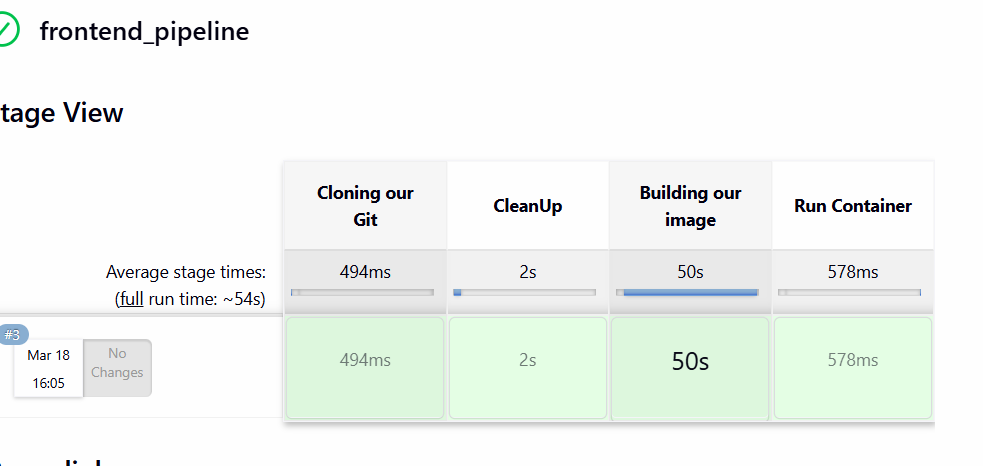
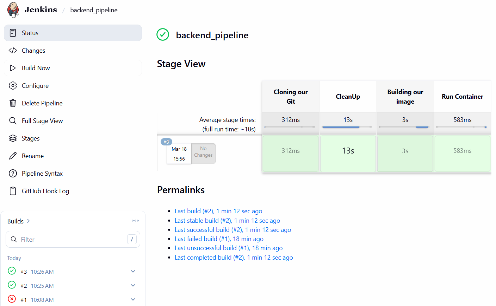

# 🚀 Automated Multi-Tier CI/CD Pipeline

A hands-on DevOps project demonstrating automated continuous integration and continuous deployment (CI/CD) for a decoupled web application hosted on AWS infrastructure.

> * 🖥️ **Frontend Client:** [shravaxd/workshop17th-frontend](https://github.com/shravxd/workshop17th-frontend)
> * ⚙️ **Backend & Infrastructure:** *You are here!*

## 🏗️ Architecture & Pipeline Workflow

 [Developer Terminal] ──(SSH)──> [AWS EC2 Instance] ──> [Jenkins Server]
                                                               │
     ┌───────────────────┬─────────────────────────┴───────────────────┐
     ▼                   ▼                                             ▼
[1. Git Clone] ──> [2. Workspace Clean] ──> [3. Docker Image Build] ──> [4. Container Run]

### 1. Cloud Infrastructure (AWS)

* **Host OS:** Deployed Linux-based **Ubuntu Server 24.04 LTS** (AMI) within the *AWS Academy Learner Lab* ecosystem.
* **Compute Resources:** Scaled up to a **`t2.large` instance type** *(2 vCPUs, 8 GiB RAM)* to seamlessly process concurrent container builds.
* **Access Security:** Initialized an RSA-encrypted private security key (`workshop.pem`) to maintain secure, authenticated SSH terminal shells.

---

### 2. Pipeline Automation (Jenkins & Docker)

Built fully automated, declarative pipelines (`frontend_pipeline` & `backend_pipeline`) that cycle through **4 key execution stages**:

* **Cloning Git:** Dynamically pulls decoupled application tiers directly from remote version control.
* **CleanUp:** Purges obsolete workplace workspace layers and dangling data to optimize cloud server storage.
* **Building Image:** Compiles isolated environment configurations using targeted production `Dockerfiles`.
* **Run Container:** Instantly provisions and spins up the newly updated application microservices on designated public ports.

---

## 🛠️ Tech Stack & Core Tools

* **Amazon Web Services (AWS EC2)**
* **Jenkins** 
* **Docker** 

---

## 📸 Deployment Visuals

### Jenkins Pipelines Overview
*Both pipelines successfully running and automating our deployments:*

### Frontend & Backend Pipeline Stage Views
*Isolated pipeline tracking for individual application tiers:*

### AWS EC2 Dashboard
*The virtual compute infrastructure hosting our live containerized applications:*

